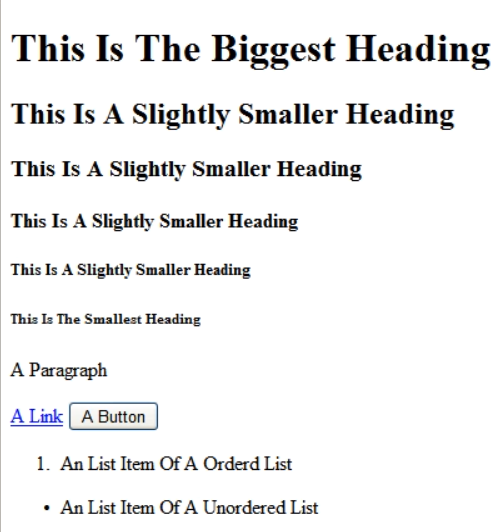
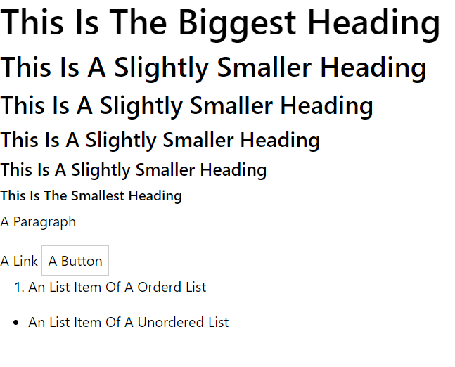

<div align="center">
<p><a href="https://github.com/krishdevdb/reseter.css/releases"></a> <a href="https://www.npmjs.com/package/reseter.css"></a> <a href="https://www.codefactor.io/repository/github/krishdevdb/reseter.css"></a> <a href="https://bundlephobia.com/result?p=reseter.css"></a><a href="https://github.com/krishdevdb/reseter.css/blob/master/LICENSE"></a> <a href="https://github.com/krishdevdb/reseter.css/commits/master"></a></p>
<br><h1>Reseter.css</h1>
<h5>A CSS Reset/Normalizer</h5>
<p><b>Reseter.css</b> is a css <b>reset</b> and <b>normalizer</b>. <b>Reseter.css</b> resets all the premade styles by the browser. Normalizes the browser's stylesheet. Removes most browser inconsistencies. Makes 90% styles be inherited by the parent. And much more...</p>
<button style="background-color: #5E8CF4; border-color: #5E8CF4; color: #ffffff;">Read Docs >></button>
</div><br>

## Table Of Contents

*   [Features](#features)
*   [Why Use Reseter.css (Must Read)](#why-use-resetercss-must-read)
*   [Ouick Start](#quick-start)
*   [Installation](#installation)
    *   [Package Managers](#package-managers)
    *   [CDN](#cdn)
    *   [Downloads](#downloads)
    *   [Clone Repository](#clone-repository)
*   [Usage](#usage)
    *   [Import In A CSS File](#import-in-css)
    *   [Link Tag In HTML's Head](#link-tag)
    *   [React](#react)
    *   [Vue](#vue)
    *   [Next.js](#nextjs)
*   [Support](#support)
*   [Roadmap](#roadmap)
*   [Authors](#authors)
*   [License](#license)
*   [Status](#status)

## Features

*   Adds New Better Styles For Elements

*   Reboots styles for a wide range of elements.

*   Corrects bugs and browser inconsistencies.

*   Sized 2.6<small>kb</small>

<a href="#resetercss">Back To Top</a>

## Why Use Reseter.css (Must Read)

Down is the result of a same html file of 3 browsers, all of chrome's headings are bolded nicely. Firefox ones are also bolded but IE ones are bolded too much. The ,font on paragraphs is also bolded in IE. The border of the button is blue in IE. There's A little less border on buttons in Firefox. These Are Only **3 browsers** and **5 kinds of tags** but there are more then 100 browsers available to the public. No one knows how many of them are not public. In fact 1000's of versions of these 100's of browsers are available. How to keep us with these browsers. The answer is **Reseter.css**.

|                   Chrome                   |                      Internet Explorer                       |                       With Reseter.css                       |
| :----------------------------------------: | :----------------------------------------------------------: | :----------------------------------------------------------: |
|  |  |  |

<a href="#resetercss">Back To Top</a>

## Quick Start

1.  Create A HTML File

    ```html
    <!DOCTYPE html>
    <html lang="en">
    <head>
        <meta charset="UTF-8">
        <meta name="viewport" content="width=device-width, initial-scale=1.0">
        <title>Testing Reseter.css</title>
    </head>
    <body>
        <h1>This Is The Biggest Heading</h1>
        <h2>This Is A Slightly Smaller Heading</h2>
        <h3>This Is A Slightly Smaller Heading</h3>
        <h4>This Is A Slightly Smaller Heading</h4>
        <h5>This Is A Slightly Smaller Heading</h5>
        <h6>This Is The Smallest Heading</h6>
        <p>A Paragraph</p>
        <a href="">A Link</a>
        <button>A Button</button>
        <ol>
            <li>An List Item Of A Orderd List</li>
        </ol>
        <ul>
            <li>An List Item Of A Unordered List</li>
        </ul>
    </body>
    </html>
    ```

2.  To the head tag add this code

    ```html
    <link rel="stylesheet" href="https://cdn.jsdelivr.net/gh/krishdevdb/reseter.css/css/reseter.min.css">
    ```

3.  Now you are all set and you can view the page

    <a href="#resetercss">Back To Top</a>

## Installation

There are various ways to install reseter.css. Like Package Managers, CDNs, Local Copies And Stuff.

### Package Managers

*   **NPM** - A NodeJs Based Package Manager.

```bash
npm install reseter.css
```

<a href="#resetercss">Back To Top</a>

*   **Yarn** - A Better Equivalent To NPM.

```bash
yarn add reseter.css
```

<a href="#resetercss">Back To Top</a>

*   **PNPM** - A Faster NodeJS Based Package Manager

```bash
pnpm install reseter.css
```

<a href="#resetercss">Back To Top</a>

*   **Meteor** - Another NodeJs Based Package Manager

```bash
meteor add krishdevdb:resetercss
```

<a href="#resetercss">Back To Top</a>

*   **Composer** - The PHP Package Manager

```bash
composer require krishdevdb/reseter.css
```

<a href="#resetercss">Back To Top</a>

*   **Bower** - A Package Manager For The Web

```bash
bower install krishdevdb/reseter.css
```

<a href="#resetercss">Back To Top</a>

### CDN

*   JsDelivir

```html
<link rel="stylesheet" href="https://cdn.jsdelivr.net/npm/reseter.css/">
```

<a href="#resetercss">Back To Top</a>

*   Unpkg

```html
<link rel="stylesheet" href="https://unpkg.com/reseter.css">
```

<a href="#resetercss">Back To Top</a>

*   Github

```html
<link rel="stylesheet" href="https://github.com/krishdevdb/reseter.css/raw/master/css/reseter.min.css">
```

<a href="#resetercss">Back To Top</a>

### Downloads

*   Reseter.min.css - https://cdn.jsdelivr.net/gh/krishdevdb/reseter.css/css/reseter.min.css
*   Reseter.css - https://cdn.jsdelivr.net/gh/krishdevdb/reseter.css/css/reseter.css
*   Full Repository - https://github.com/krishdevdb/reseter.css/archive/master.zip

<a href="#resetercss">Back To Top</a>

### Clone Repository

*   Using Git

    ```bash
    git clone https://github.com/krishdevdb/reseter.css.git
    ```

    <a href="#resetercss">Back To Top</a>

*   Github Cli

    ```bash
    gh repo clone krishdevdb/reseter.css
    ```

    <a href="#resetercss">Back To Top</a>

## Usage

### Import In CSS

This Is The Best Way To Use Reseter.css. First Import Reseter.css then add your custom styles

```css
@import "path/to/reseter.min.css";

.element{
    /** Your Custom Style's Here **/
}
```

```html
<link rel="stylesheet" type="text/css" href="path/to/your-custom-stylesheet.css">
```

<a href="#resetercss">Back To Top</a>

### Link Tag

Using It With A Browser Is Really Simple. First Link To Reseter.css Then Your Custom Stylesheet

```html
<head>
<link rel="stylesheet" type="text/css" href="path/to/reseter.min.css">
<link rel="stylesheet" type="text/css" href="path/to/your-custom-stylesheet.css">
</head>
```

<a href="#resetercss">Back To Top</a>

> **Warning!**
>
> Make Sure To Link Your Custom Stylesheet After Reseter.css Else Your Custom Styles Might Not Be Implemented

### React

1.  Apply It Globaly

    In your js file

    ```jsx
    import "path/to/reseter.min.css";
    ```

<a href="#resetercss">Back To Top</a>

   <p align="center"><b>Or</b></p>

In your global css file

```css
@import "path/to/reseter.min.css";

.element{
    /** Custom Styles **/
}
```

Then in your js file

```jsx
import React from 'react';
import ReactDOM from 'react-dom';
import './path/to/global.css';
import App from './App';

ReactDOM.render(
  <React.StrictMode>
  <App />
  </React.StrictMode>,
  document.getElementById('root')
);
```

<a href="#resetercss">Back To Top</a>

2.  In A Single Page Using React Helmet
    ```jsx
    import React from "react";
    import { Helmet } from "react-helmet";
                               
    export default function Page() {
      return (
        <div>
          <Helmet>
            <link rel="stylesheet" href="path/to/reseter.css" />
            <link rel="stylesheet" href="path/to/custom/style-sheet.css" />
          </Helmet>
          <h1>Login</h1>
          <p>This is the login page</p>
        </div>
      );
    }
    ```

<a href="#resetercss">Back To Top</a>

<p align="center"><b>Or</b></p>

In Your Custom Stylesheet

```css
@import "path/to/reseter.min.css";

.element{
/**Custom Styles Here**/
}
```

In Your JS File

```jsx
import React from "react";
import { Helmet } from "react-helmet";

export default function Page() {
  return (
    <div>
      <Helmet>
        <link rel="stylesheet" href="path/to/custom/style-sheet.css" />
      </Helmet>
      <h1>Login</h1>
      <p>This is the login page</p>
    </div>
  );
}
```

<a href="#resetercss">Back To Top</a>

### Vue

In Your Vue File Add This Code

```vue
<style>
  @import 'path/to/reseter.min.css';
</style>
```

<p align="center"><b>Or</b></p>

```vue
<style scoped src="@/path/to/reseter.min.css">
</style>
```

<p align="center"><b>Or</b></p>

```js
import Vue from 'vue'

require('@/path/to/reseter.min.css')
```

### Next.js

1.  Apply It Globaly

    In **\_app.js** inside your **pages** directory

    ```jsx
    import "path/to/reseter.min.css";
    ```

    <p align="center"><b>Or</b></p>

    In your global css file

    ```css
    @import "path/to/reseter.min.css";
    .element{
        /** Custom Styles **/
    }
    ```

    Then In Your **\_app.js**

    ```jsx
    import "path/to/global-styles.css";
                                           
    export default function App({ Component, pageProps }){
       return <Component {...pageProps} />
    }
    ```

    <a href="#resetercss">Back To Top</a>

2.  Apply It To A Specific Page

    ```jsx
    import * from "react";
    import Head from "next/head";
                                          
    export default function Page(){
        return(
        <div>
              <Head>
                  <link rel="stylesheet" href="path/to/reseter.min.css">
                  <link rel="stylesheet" href="path/to/custom/style-sheet.css" />
              </Head>  
         </div>
        )
    }
    ```

    <a href="#resetercss">Back To Top</a>

<p align="center"><b>Or</b></p>

In your css file

```css
 @import "path/to/reseter.min.css";
 .element{
     /** Custom Styles **/
 }
```

Then In Your **\_app.js**

```jsx
import * from "react";
import Head from "next/head";

export default function Page(){
 return(
 <div>
       <Head>
           <link rel="stylesheet" href="path/to/your-custom.css">
       </Head>  
  </div>
 )
}
```

<a href="#resetercss">Back To Top</a>

> Know/Want Any Other Usage Option/Platform
>
> Please Add A Issue In Github With The Label Feature Request.

## Support

Hi! 👋 We’re excited that you’re using **Reseter.css** and we’d love to help.

*   [Chat Us On Discord](https://discord.gg/N87Apthjgu)
*   [Start A Discussion On Github](https://github.com/krishdevdb/reseter.css/discussions)
*   [Add A Issue On Github](https://github.com/krishdevdb/reseter.css/issues)

## Roadmap

*   Comment Blocks In The Sources

*   Long Documentation

*   Guide

*   And Whatever You Put On The Github Issues WIth The Label Of Feature Request

## Authors

|  |
| :----------------------------------------------------------: |
|                            Krish                             |
|           [Github](https://github.com/krishdevdb)            |
|             [Email](mailto:krishdevdb@gmail.com)             |

## License

    MIT License

    Copyright (c) 2021 Krish Dev DB

    Permission is hereby granted, free of charge, to any person obtaining a copy
    of this software and associated documentation files (the "Software"), to deal
    in the Software without restriction, including without limitation the rights
    to use, copy, modify, merge, publish, distribute, sublicense, and/or sell
    copies of the Software, and to permit persons to whom the Software is
    furnished to do so, subject to the following conditions:

    The above copyright notice and this permission notice shall be included in all
    copies or substantial portions of the Software.

    THE SOFTWARE IS PROVIDED "AS IS", WITHOUT WARRANTY OF ANY KIND, EXPRESS OR
    IMPLIED, INCLUDING BUT NOT LIMITED TO THE WARRANTIES OF MERCHANTABILITY,
    FITNESS FOR A PARTICULAR PURPOSE AND NONINFRINGEMENT. IN NO EVENT SHALL THE
    AUTHORS OR COPYRIGHT HOLDERS BE LIABLE FOR ANY CLAIM, DAMAGES OR OTHER
    LIABILITY, WHETHER IN AN ACTION OF CONTRACT, TORT OR OTHERWISE, ARISING FROM,
    OUT OF OR IN CONNECTION WITH THE SOFTWARE OR THE USE OR OTHER DEALINGS IN THE
    SOFTWARE.

## Status

This project is currently being maintained. And Will Be Maintained. If You Like This Project And Want This Project To Never Exhaust. Please Consider Donating.
